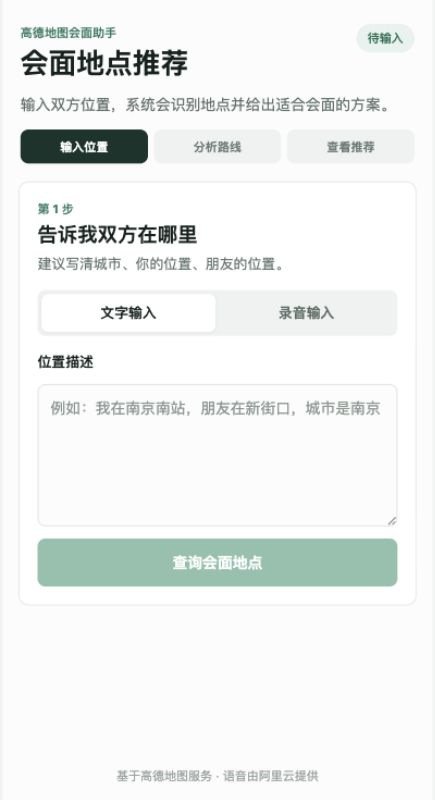
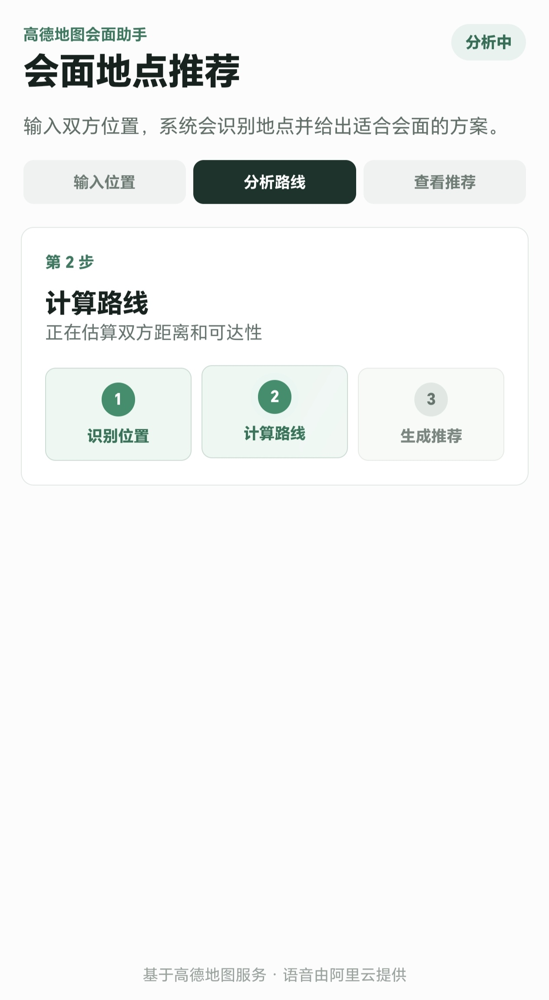
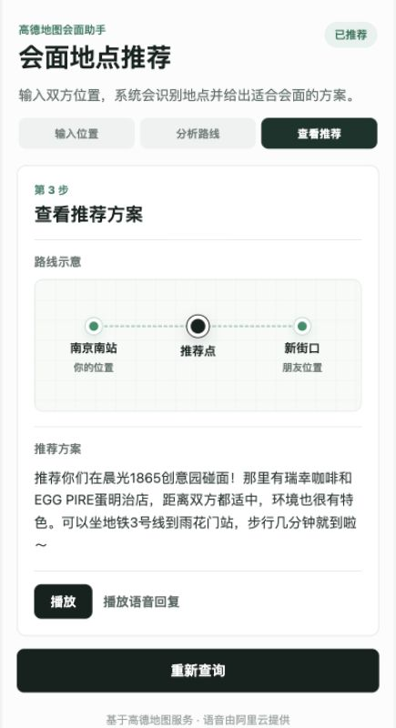
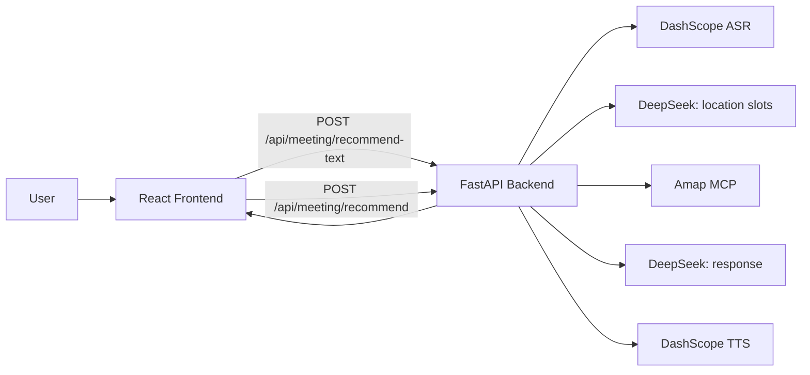

# Meeting Point Finder

一个面向移动端 Web 的会面地点推荐应用。用户输入或录音描述两个人的位置后，后端会识别地点、调用地图服务计算路线与周边候选点，并返回自然语言推荐结果。

> 本项目需要第三方 API Key 才能完整运行。请只提交 `.env.example`，不要提交真实 `.env` 或任何密钥。

## UI Preview

### 1. 输入双方位置



### 2. 分析路线



### 3. 查看推荐方案



## Features

- 手机端优先的 React 页面
- 支持文字输入和语音输入
- 麦克风不可用时自动降级到文字输入
- 分析过程包含三步反馈：识别位置、计算路线、生成推荐
- 推荐结果包含结构化路线示意和语音回复播放
- 后端按日期和请求 ID 保存运行日志，便于排查问题

## Tech Stack

### Frontend

- React 18
- TypeScript
- Vite
- CSS 动效与响应式布局

### Backend

- FastAPI
- Uvicorn
- Aliyun DashScope ASR/TTS
- DeepSeek 文本理解与回复生成
- Amap MCP 地理编码、距离计算与周边搜索

## Project Structure

```text
meeting/
├── backend/
│   ├── main.py
│   ├── config.py
│   ├── requirements.txt
│   ├── .env.example
│   ├── services/
│   └── Storage/              # 运行时生成，已被 .gitignore 忽略
├── frontend/
│   ├── package.json
│   ├── vite.config.ts
│   └── src/
├── docs/
│   └── screenshots/
├── .gitignore
└── README.md
```

## Architecture



## Processing Flow

### Text Input

```text
用户输入双方位置
  -> 前端请求 /api/meeting/recommend-text
  -> DeepSeek 提取 location1 / location2 / city
  -> Amap MCP 地理编码、距离计算、周边搜索
  -> DeepSeek 生成推荐话术
  -> DashScope TTS 尝试生成语音
  -> 返回推荐文本、地点槽位、可选 audioUrl
```

### Voice Input

```text
用户录音
  -> 前端上传音频到 /api/meeting/recommend
  -> 后端保存音频文件
  -> DashScope ASR 识别语音文本
  -> 后续流程同文字输入
```

### Runtime Logs

后端运行产物会按日期和请求 ID 保存：

```text
backend/Storage/
└── 20260603/
    ├── service_20260603.log
    └── req_20260603_123456_abcd1234/
        ├── audio_*.webm
        ├── audio_*_asr.json
        ├── req_*_slot.json
        ├── req_*_mcp.json
        └── req_*_tts.json
```

`Storage/` 运行时生成，已被 .gitignore 忽略

## Getting Started

### Prerequisites

- Python 3.11+
- Node.js 18+
- npm
- DashScope API Key
- DeepSeek API Key
- Amap API Key

### 1. Clone

```bash
git clone <your-repo-url>
cd meeting
```

### 2. Configure Backend

```bash
cd backend
python3.11 -m venv venv
source venv/bin/activate
python -m pip install --upgrade pip
pip install -r requirements.txt
cp .env.example .env
```

Edit `backend/.env`:

```bash
SERVER_HOST=0.0.0.0
SERVER_PORT=8013
SERVER_RELOAD=false
STORAGE_DIR=Storage

DASHSCOPE_API_KEY=your_dashscope_api_key_here
DEEPSEEK_API_KEY=your_deepseek_api_key_here
DEEPSEEK_BASE_URL=https://api.deepseek.com
AMAP_API_KEY=your_amap_api_key_here
```

Optional:

```bash
AMAP_MCP_URL=https://mcp.amap.com/mcp?key=your_amap_api_key_here
```

### 3. Start Backend

```bash
cd backend
source venv/bin/activate
python main.py
```

Backend runs at:

```text
http://localhost:8013
```

Health check:

```bash
curl http://localhost:8013/api/health
```

### 4. Configure Frontend

Open a second terminal:

```bash
cd frontend
npm install
```

### 5. Start Frontend

```bash
npm run dev
```

Frontend runs at:

```text
http://localhost:5177
```

Vite proxies `/api` requests to `http://localhost:8013`.

## Build

Frontend production build:

```bash
cd frontend
npm run build
```

Backend syntax check:

```bash
cd backend
source venv/bin/activate
python -m py_compile main.py
```

## API Overview

### `POST /api/meeting/recommend-text`

Request:

```json
{
  "text": "我在南京南站，朋友在新街口，城市是南京"
}
```

Response:

```json
{
  "success": true,
  "textResponse": "推荐结果文本",
  "audioUrl": "optional_audio_url",
  "slots": {
    "location1": "南京南站",
    "location2": "新街口",
    "city": "南京"
  }
}
```

### `POST /api/meeting/recommend`

Upload an audio file with form field `audio`.

## Troubleshooting

### `ModuleNotFoundError`

Make sure the backend virtual environment is active and dependencies are installed:

```bash
cd backend
source venv/bin/activate
pip install -r requirements.txt
```

### `zsh: command not found: python`

Use `python3.11` to create the virtual environment, then activate it:

```bash
cd backend
python3.11 -m venv venv
source venv/bin/activate
python --version
```

### Microphone Permission

Some embedded browsers cannot access the microphone. In that case, use text input. The app will automatically fall back to text input when microphone access fails.
